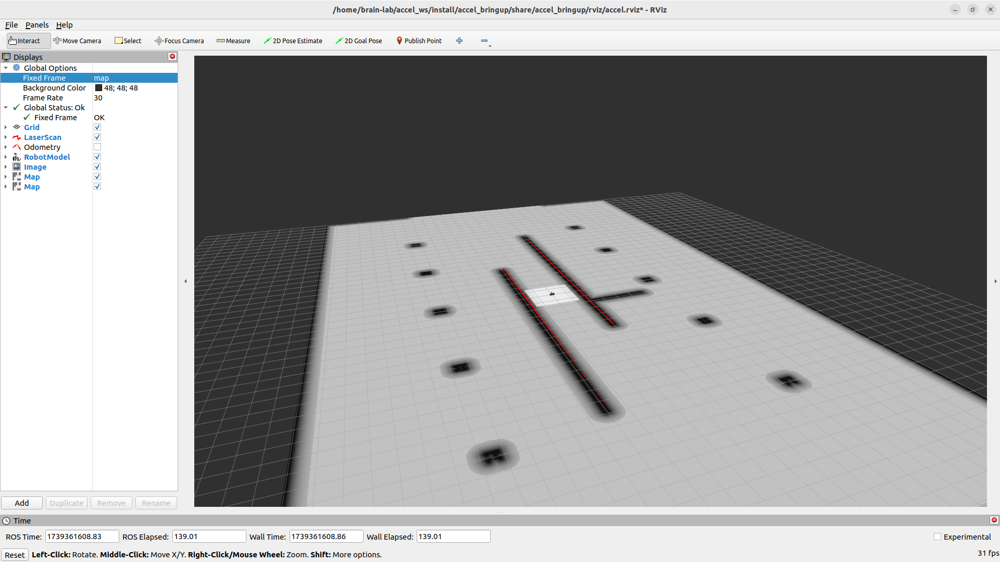
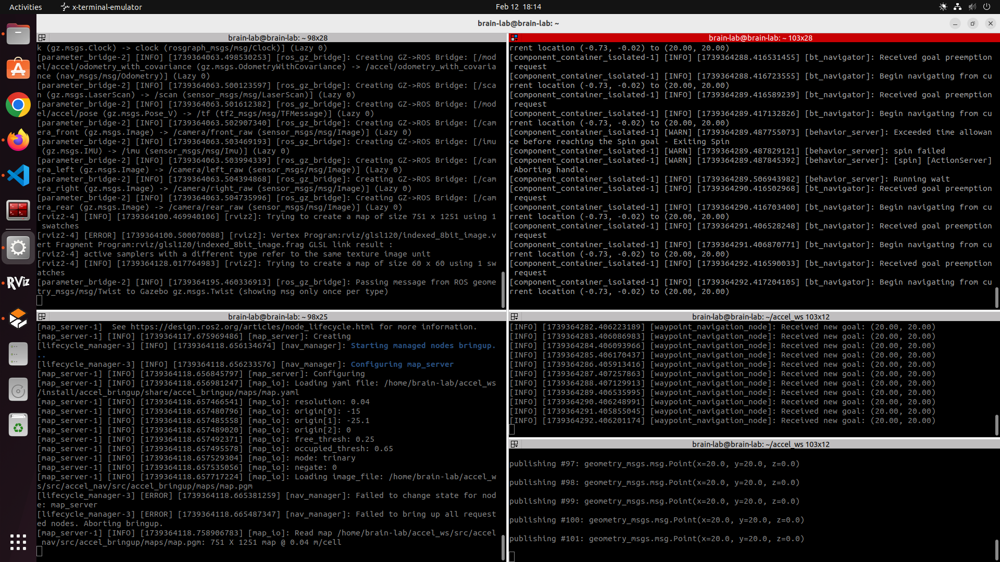

# Autonomous Navigation with Nav2 in Gazebo

This project presents a simulation model for autonomous navigation of a mobile robot using **ROS2 Humble** and the **Gazebo Harmonic**. The model integrates LiDAR, Camera, and Wheel Odometry to implement **SLAM ToolBox**, **AMCL** and **Nav2** and for mapping, localization and autonomous navigation respectively.

## Workspace Summary

The whole package is defined on prefix of **accel** under inspiration of developing this project to complete navigation task provided by **Acceleration Robotics**. This package, namely **accel_nav** is followed by sub-packages bringup, control, description, localization, navigation and msgs.

- **accel_bringup** - This package contains launch files for spawning robot in Gazebo Harmonic, mapping environment using SLAM, localizaing and navigating autonomously.
- **accel_description** - This package contains sdf files and meshes for both robot model and world whose warehouse library is customized to match the maze like world requirement as per the problem statement. 
- **accel_control** - This package contains implementation of publishing occupancy grids on /map, subscribing to LiDAR on /laser_scan and provides service for shareing the map via publish_map_service inside header file namely control.hpp.
- **accel_localization** - This package contains header files for kalman filter, joystick controller and behavious tree.
- **accel_navigation** - This package contains C++ node written to set initial pose, navigate to a waypoint given as input from user via terminal, print on the achievement of goal and proceed to next input until terminated.
- **accel_msgs** - This package contains standard message files for communication.

### 1. **Simulated World**

The warehouse library has been modified to contain maze-like environment, having walls as static obstacles. However the same *model.sdf* can be modified further to bring a dynamic obstacle on the map which will be avoided from collision during navigation using *navigation stack*. 

### 2. **Onboard Sensors**

- **Inertial Measurement Unit (IMU)**: Provides orientation and angular velocity data.
- **Wheel Odometry**: Ensures vehicle state feedback; however contains slight drift which is yet to be improved.
- **LiDAR**: Mounted for obstacle detection and environmental mapping.
- **Cameras**: Front, rear, left and right facing cameras.

### 3. **Mapping and Autonomous Navigation**

- **SLAM** techniques implemented for real-time mapping and understanding of the environment.
- **AMCL (Adaptive Monte Carlo Localization)** for improved positional accuracy.
- Integrated with the **Nav2 Stack** for autonomous navigation.
- **Fine-tuned** parameters for optimized and increased efficiency in navigation performance.
- Extended package for autonomous navigation using **waypoints** using C++ node.

### 4. **Additional**

Sesnor fusion can be executed using *Kalman Filter* which is under development but available inside workspace.

### 5. **Visualization**

- Full model and sensor data visualization in **RViz2**, providing insights into robot states and environmental feedback.

## Installation and Usage

1. Clone the repository inside src of workspace:
    `git clone https://github.com/iShuchi/accel_nav.git`
    
2. Locate yourself just inside of your workspace and Build the project:
    `colcon build && source install/setup.bash`

3. Set environment variables:
    `export GZ_SIM_RESOURCE_PATH=$GZ_SIM_RESOURCE_PATH:/your/path/accel_nav/src`
    `export ROS_PACKAGE_PATH=$ROS_PACKAGE_PATH:/your/path/accel_nav/src`

4. **Spawning in the Simulation**:
    `ros2 launch accel_bringup accel_spawn.launch.py`
    If frames aren't loaded in the RViz then simply play the pause button available on bottom-left of Gazebo Simulator

5. **Mapping using SLAM Tool-Box**:
    `ros2 launch accel_bringup slam.launch.py`

    To map the environment, add map topic on RViz and move the robot by publishing velocities using
    `ros2 topic pub /cmd_vel geometry_msgs/msg/Twist "{linear: {x: 0.0, y: 0.0, z: 0.0}, angular: {x: 0.0, y: 0.0, z: 0.0}}" -r 10`

    After building the entire map, the map can be saved using commanmd,
    `ros2 run nav2_map_server map_saver_cli -f map_name`

    **NOTE** - Map of the environment with .yaml and .pgm file is already saved inside ***maps*** directory of ***accel_bringup*** package which can be directly used for navigation.
    **CAUTION** - Change location of map.pgm file inside ***map.yaml*** and location of map.yaml inside ***navigation.yaml*** available inside config directory.

6. **Autonomous Navigation**
    `ros2 launch accel_bringup localization.launch.py`
    Change the fixed frame from *odom* to *map* and then add map from global costmap on RViz.

    `ros2 launch accel_bringup amcl.launch.py`
    Add map topic from local costmap on RViz and now the robot is ready to take **2D Pose Estimation** and **2D Goal Pose**

    `ros2 run accel_navigation waypoint_navigation_node`
    This node will initiate navigation using waypoint, waiting user to publish coordinate data from terminal

    `ros2 topic pub /goal_input geometry_msgs/msg/Point "{x: 20.0, y: 20.0, z: 0.0}"`
    This will publish target coordinates and will update correspondingly to C++ node along with navigation stack. However, despite of positive results in the terminal, no change is observed in Gazebo or RViz (***under-development***). Refer to image below.

    

## Future Work

Resolving the communication issues because of which the gazebo topic of robot model is unable to take goal from terminal despite of updated navigation goal messages.

## Gallery

Drive Link - [Simulation videos and Images](https://drive.google.com/drive/folders/1ItsTxGNiisjuD24GJPkhzQUjMlxe-0Mv?usp=sharing)
